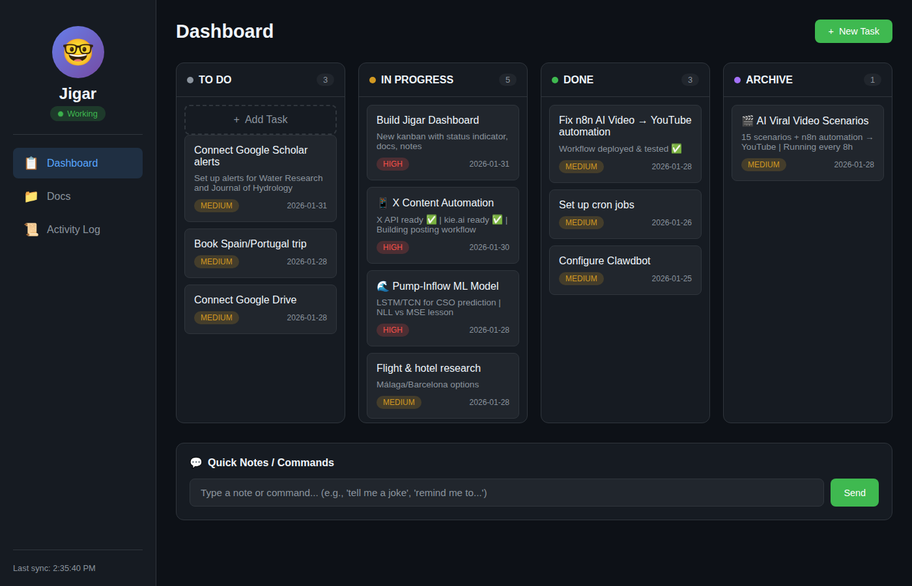

# 🤓 Jigar Dashboard

A personal productivity dashboard for Clawdbot/Jigar AI assistant.



## ✨ Features

- **📋 Kanban Board** - Task management with status changes (To Do → In Progress → Done → Archive)
- **📁 Document Viewer** - Browse and edit workspace markdown files
- **⏰ Cron Jobs** - View all scheduled jobs with descriptions, schedules, and run history
- **📜 Activity Log** - Track assistant activity (coming soon)

## 🚀 Quick Start

```bash
# Clone the repository
git clone https://github.com/sinsinaT/jigar-dashboard.git
cd jigar-dashboard

# Start the server
npm start

# Dashboard runs at http://localhost:18800
```

## 📁 Project Structure

```
jigar-dashboard/
├── src/
│   └── server.js           # Node.js backend server
├── public/
│   └── index.html          # Main dashboard (single HTML with CSS/JS)
├── data/
│   ├── tasks.json          # Kanban tasks data
│   ├── cron-jobs.json      # Scheduled jobs with descriptions
│   ├── status.json         # Bot status
│   └── video-callbacks.json # Video generation callbacks
├── scripts/
│   └── sync-cron.js        # Cron synchronization utility
├── package.json
├── .gitignore
└── README.md
```

## 🔌 API Endpoints

| Endpoint | Method | Description |
|----------|--------|-------------|
| `/` | GET | Serve dashboard |
| `/api/tasks` | GET | Get all tasks |
| `/api/tasks` | POST | Save tasks |
| `/api/docs` | GET | List markdown files |
| `/api/file?path=` | GET | Read file content |
| `/api/file` | POST | Save file content |
| `/api/cron-jobs` | GET | Get scheduled jobs with descriptions |
| `/api/status` | GET | Get bot status |
| `/api/note` | POST | Send note/command |

## ⏰ Cron Jobs

The dashboard displays all scheduled jobs with:
- **Name & Icon** - Visual identification
- **Schedule** - Cron expression + human-readable timing
- **Next Run** - When the job will run next
- **Description** - What the job actually does
- **Status** - Last run result (✅/❌)

Jobs are automatically synced by Clawdbot during heartbeat checks.

## 🛠️ Configuration

The dashboard connects to the Clawdbot workspace at `/root/claw` by default. 
Modify `WORKSPACE` in `src/server.js` to change this.

## 🔗 Integration with Clawdbot

This dashboard is designed to work with [Clawdbot](https://github.com/clawdbot/clawdbot).

To update cron jobs data from Clawdbot:
```javascript
// During heartbeat, Clawdbot syncs data/cron-jobs.json
cron.list() → parse → write to data/cron-jobs.json
```

## 📝 Usage

### Add a Task
1. Click "+ New Task" button
2. Enter title, notes, and priority
3. Click "Create Task"

### Change Task Status
1. Click on any task card
2. Select new status from dropdown
3. Click "Save Changes"

### View Cron Jobs
1. Click "⏰ Cron Jobs" in sidebar
2. See all jobs sorted by next run time
3. Each job shows what it does and when

## 📄 License

MIT License - see LICENSE file

---

Built with 🦞 by Jigar for Sina
